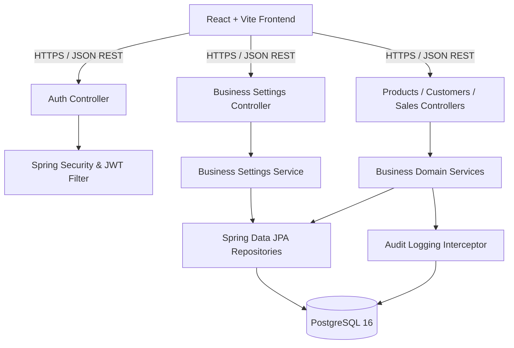

# Architecture & Technical Design

## 1. Architectural Principles
- **Separation of Concerns**: Strict multi-tier layering (Controller -> Service -> Repository -> Database).
- **Strict Data Contracts**: Controllers strictly consume and return DTOs with Bean Validation. Domain entities are never directly exposed across the REST boundary.
- **Financial Immutability**: Historical financial transactions, invoice snapshots, and inventory changes cannot be modified or hard-deleted.
- **Precision Accounting**: All monetary attributes are represented as `BigDecimal` in Java and `NUMERIC(15,2)` in PostgreSQL. Floating-point arithmetic is prohibited.
- **Resilient Storage Abstraction**: File assets (invoice PDFs, supplier receipts, logo) interact through a `StorageService` interface allowing seamless transition between local disk and cloud S3 buckets.

## 2. Component Diagram

## 3. Security Design
- Stateless token verification with JSON Web Tokens (JJWT 0.12.x).
- Passwords salted and hashed with BCrypt (work factor 12).
- Strict CORS rules restricting origins to the configured client domain.
- Content Security Policy and HTTP protection headers enabled.
